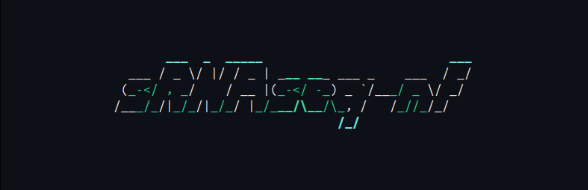
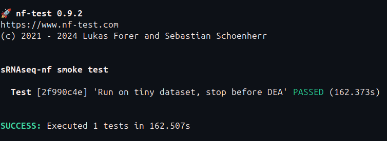
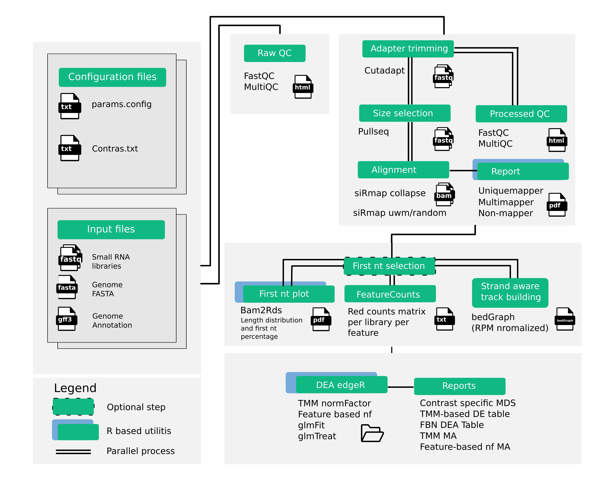
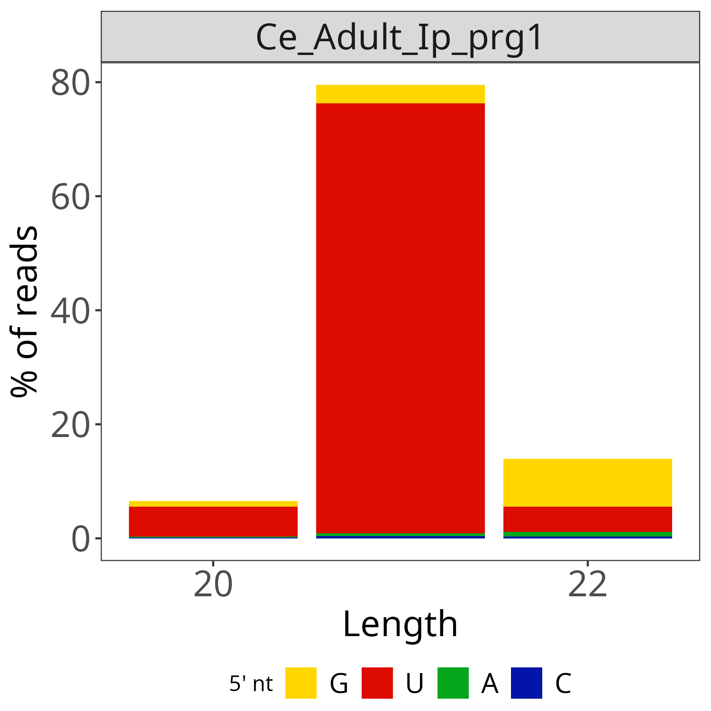
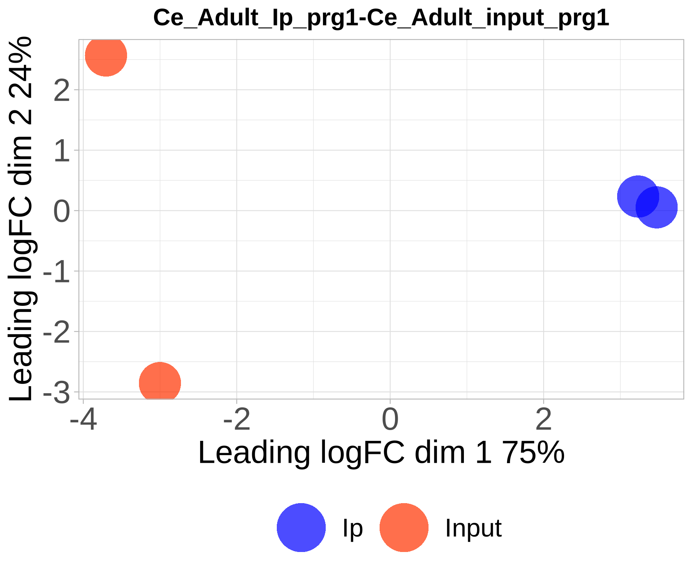
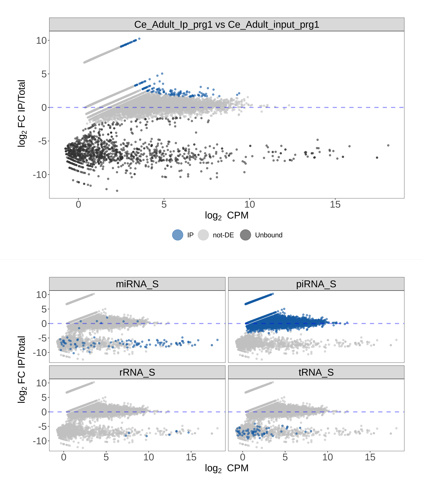
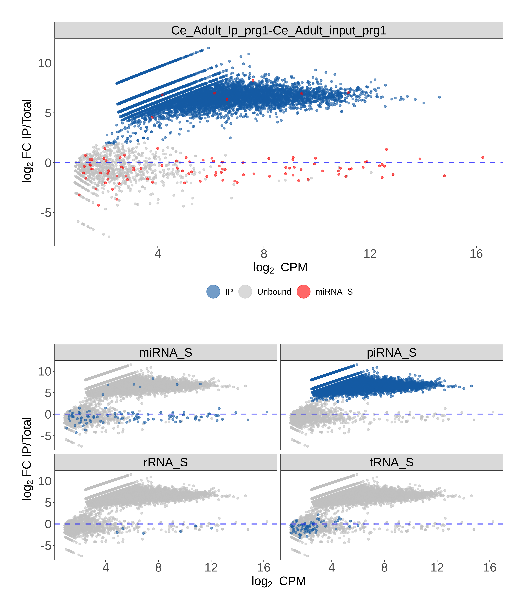

# sRNAseq-nf — Nextflow pipeline for small RNA (sRNA) alignment, quantification & DEA

[](https://github.com/imu93/sRNAseq-nf/issues) [![nextflow](https://img.shields.io/badge/powered_by:-Nextflow-9EE0CE?logo=)](https://www.nextflow.io/)
[](https://mamba.readthedocs.io/)
[![apptainer](https://img.shields.io/badge/use_with:-apptainer-blue?logo=)]([https://www.docker.com/](https://apptainer.org/docs/admin/main/installation.html))

A reproducible *Nextflow* pipeline for small RNA-seq that collapses identical reads, maps with Bowtie1, and resolves multi-mappers via a Unique-Weighted Mode (UWM) implemented in our own Python tool *siRmap* (with optional random assignment). The pipeline supports optional 5′-nucleotide filtering at the BAM level, feature-level quantification with featureCounts, and a category-anchored edgeR workflow tailored for IP vs Input designs.

---

## Features
- **Identical read collapse**: speed up alignment process for high-sequencing depth
- **siRmap (UWM)**: probabilistic placement of multi-mapping reads using unique-read context (inspired in ShortStack -u mode)
- **Optional 5′-nt gating** (`--first_nt`) with strand awareness: keep reads whose **original 5′ base as sequenced** is in a set (e.g., `G` or `AT`). Control whether filtered BAMs drive quant/DEA via `--apply_first_nt_downstream`
- **Feature quantification** with **Rsubread/featureCounts** against a user-supplied, double-stranded GFF3
- **DEA for IP vs Input**: custom **feature–anchored scaling** (trimmed, stable subset) + **edgeR `glmTreat`** (minimum effect size)
- **Tracks**: CPM-scaled **bedGraphs** normalized by **mapped** reads, with minus-strand negated
- **Plots**: MDS/MA panels, class-focused views, and first-nt distributions
---

## Installation

### Quick install (conda/mamba)
For mamba installation we recommend miniforge
[Miniforge](https://github.com/conda-forge/miniforge)

```
curl -L -O "https://github.com/conda-forge/miniforge/releases/latest/download/Miniforge3-$(uname)-$(uname -m).sh"
```

```
bash Miniforge3-$(uname)-$(uname -m).sh
```

Then build srnanf environment
```bash
mamba create -n srnanf_env -c conda-forge -c bioconda -c defaults \
  python=3.11  bowtie pigz bc cutadapt fastqc multiqc bedtools \
  samtools pullseq gawk openjdk=17 nextflow nf-test pysam tqdm \
  r-base=4.3.1 bioconductor-rsubread bioconductor-rtracklayer  \
  bioconductor-edger bioconductor-plyranges bioconductor-rsamtools \
  r-pacman r-ggplot2 r-ggpubr r-dplyr r-purrr r-gplots r-optparse r-reshape r-reshape2 \
  r-kableextra r-ggbreak r-stringr r-pals r-stringi r-scales r-tidyr r-tibble
conda activate srnanf_env
```

Or using the provided yml file:
```
mamba env create -f srnanf_env.yml
```

---
### HPC considerations
In case conda/mamba is not accessible an apptainer .def file is distributed in this repository **sRNAseq-nf/env/**. 
For apptainer installation take a look at:

```
https://apptainer.org/docs/admin/main/installation.html
```
Once apptainer is installed, it is time to build the container. 
```
cd sRNAseq-nf/env/
apptainer build ./srnanf.sif ./srnanf.def
apptainer exec srnanf.sif nextflow -version
mkdir -p .appt-home .nxf/framework/version .nxf-tmp .nextflow/plugins # version must be your nextflow version
```

Now to find the nf.jar
```
apptainer exec /home/isaac12/software/sRNAseq-nf/env/srnanf.sif   bash -lc 'command -v nextflow; \
	find / -maxdepth 5 -type f -name "nextflow-*-one.jar" 2>/dev/null | head -n 20' # Just in case the version change 

apptainer exec srnanf.sif bash -lc 'cat /root/.nextflow/framework/25.04.7/nextflow-25.04.7-one.jar' > .nxf/framework/25.04.7/nextflow-25.04.7-one.jar
```
> Alternatively the /env directory contains a yml file that can be used a source

Run with `-with-conda`

---

## Inputs & assumptions

- **FASTQ**: gzipped reads per sample. 
- **Genome**: FASTA. 
- **Annotation**: GFF3 with **double-stranded entries** per feature/class (e.g., `miRNA_S`, `miRNA_As`)
- **Contrast file**: TAB separated file with 5 columns (contrast, type, group, c_name and order)

**Example `contrast.txt`:**
```
contrast	type	group	c_name	order
ce_prg1_Ip-ce_prg1_input	prg1	Ip	ce_prg1_Ip_1	1
ce_prg1_Ip-ce_prg1_input	prg1	Ip	ce_prg1_Ip_2	1
ce_prg1_Ip-ce_prg1_input	prg1	input	ce_prg1_input_1	2
ce_prg1_Ip-ce_prg1_input	prg1	input	ce_prg1_input_2	2
```
> Our edgeR script uses the type column as a reference to look string patterns that matches the column names of the Rsubread/featureCounts table. Users can pass patterns like _Ip_prg1, _Ip_rnase_prg1, to look for specific set of libraries. 
> The c_name column must include the library ID. For example ce_prg1_Ip_1 and ce_prg1_Ip_2 are biological replicates 1 and 2 respectively. 

For complex contrast files for multiple DEA, a FC and FDR columns can be added. This way each DEA can be performed with specifc cutoff values.
For example, the following contrast.txt was built to perform multiple DEA for four datasets of AGO IPs and their respective inputs in *C. elegans* at the L4 developmental stage, using different log2FC and FDR values for each contrast.

To enable this utility, users must set the variable **treshold_inc = true** in the **params.config** file used by sRNAseq-nf (see below). This will block any lfc or fdr passed to the **params.config** file, and will use the values specified in the **contrast.txt** file. 
```
contrast	type	group	c_name	order	FC	FDR
Ce_L4_Ip_alg5-Ce_L4_input_alg5	alg5	Ip	Ce_L4_Ip_alg5_1	1	1	0.05
Ce_L4_Ip_alg5-Ce_L4_input_alg5	alg5	Ip	Ce_L4_Ip_alg5_2	1	1	0.05
Ce_L4_Ip_alg5-Ce_L4_input_alg5	alg5	input	Ce_L4_input_alg5_1	2	1	0.05
Ce_L4_Ip_alg5-Ce_L4_input_alg5	alg5	input	Ce_L4_input_alg5_2	2	1	0.05
Ce_L4_Ip_ppw2-Ce_L4_input_ppw2	ppw2	Ip	Ce_L4_Ip_ppw2_2	1	2	0.01
Ce_L4_Ip_ppw2-Ce_L4_input_ppw2	ppw2	Ip	Ce_L4_Ip_ppw2_3	1	2	0.01
Ce_L4_Ip_ppw2-Ce_L4_input_ppw2	ppw2	input	Ce_L4_input_ppw2_2	2	2	0.01
Ce_L4_Ip_ppw2-Ce_L4_input_ppw2	ppw2	input	Ce_L4_input_ppw2_3	2	2	0.01
Ce_L4_Ip_rde1-Ce_L4_input_rde1	rde1	Ip	Ce_L4_Ip_rde1_2	1	0.2630344	0.05
Ce_L4_Ip_rde1-Ce_L4_input_rde1	rde1	Ip	Ce_L4_Ip_rde1_3	1	0.2630344	0.05
Ce_L4_Ip_rde1-Ce_L4_input_rde1	rde1	input	Ce_L4_input_rde1_2	2	0.2630344	0.05
Ce_L4_Ip_rde1-Ce_L4_input_rde1	rde1	input	Ce_L4_input_rde1_3	2	0.2630344	0.05
Ce_L4_Ip_wago4-Ce_L4_input_wago4	wago4	Ip	Ce_L4_Ip_wago4_1	1	1	0.05
Ce_L4_Ip_wago4-Ce_L4_input_wago4	wago4	Ip	Ce_L4_Ip_wago4_2	1	1	0.05
Ce_L4_Ip_wago4-Ce_L4_input_wago4	wago4	input	Ce_L4_input_wago4_1	2	1	0.05
Ce_L4_Ip_wago4-Ce_L4_input_wago4	wago4	input	Ce_L4_input_wago4_2	2	1	0.05
```

---

## Configuration (`params.config`)
The params.config contains all the requested parameters for sRNAseq-nf
```groovy
params {
  reads       = "/path/to/fastq/*.fastq.gz"
  threads     = 4
  adapter     = "AGATCGGAAGAG"
  minlen      = 18
  maxlen      = 27
  genome      = "/path/to/genome.fa"
  annotation  = "/path/to/annotation.gff3"
  offrate_sm  = 4       
  thr_sm      = 12      
  smem_sm     = "12G"   
  assign_mode = 'uwm'
  wins_sm     = 200  
  minoverlap  = 0.7
  contrast    = "/home/isaac/storage/Data/CELE_ANN/sirmap/contrast.txt"
  treshold_inc = false
  lfc         = 2
  fdr         = 0.01
  hk_norm     = true
  norm_feature = "miRNA_S"
  stringent_tmm = false
  first_nt    = "T"
  apply_first_nt_downstream = true

}
```

| Param                       | Type                | Example / Default                                                                 | What it controls                                                                                               |
|----------------------------|---------------------|------------------------------------------------------------------------------------|---------------------------------------------------------------------------------------------------------------|
| `reads`                    | string (glob)       | `/home/user/.../fastq/*.fastq.gz`                                                  | Input FASTQ files (gz allowed). Glob is expanded by Nextflow.                                                 |
| `threads`                  | int                 | `4`                                                                                | Default CPU threads for mapping/IO steps (Bowtie, samtools, etc.).                                            |
| `adapter`                  | string (DNA)        | `AGATCGGAAGAG`                                                                     | 3′ adapter sequence for trimming (e.g., Illumina TruSeq).                                                     |
| `minlen`                   | int                 | `18`                                                                               | Minimum read length (after trimming) kept for analysis.                                                       |
| `maxlen`                   | int                 | `27`                                                                               | Maximum read length (after trimming) kept for analysis.                                                       |
| `genome`                   | path                | `/home/user/.../genomic.fa`                                                        | Reference genome FASTA used to build/point Bowtie index.                                                      |
| `annotation`               | path                | `/home/user/.../overlapping_annotation.gff3`                                       | GFF3 with sRNA feature annotations used for counting/reporting.                                               |
| `offrate_sm`               | int                 | `4`                                                                                | Bowtie **index** offrate (sampling rate). Lower = bigger index, faster align; higher = smaller index, slower. |
| `thr_sm`                   | int                 | `12`                                                                               | Threads for mapping/sorting steps in the small-RNA mapping stage.                                             |
| `smem_sm`                  | string (size)       | `12G`                                                                              | Samtools sort memory **per thread** (e.g., `2G`, `8G`, `1200M`) during mapping stage.                         |
| `assign_mode`              | string (enum)       | `uwm`                                                                              | Multimapper resolution: `uwm` = Unique-Weighted Mode; `random` = uniform random placement.                    |
| `wins_sm`                  | int (nt)            | `200`                                                                              | Window size (nt) for UWM scoring around each candidate alignment (strand-aware).                              |
| `minoverlap`               | float (0–1)         | `0.7`                                                                              | Minimum fractional overlap of a read with a feature to count it.                                              |
| `contrast`                 | path                | `/home/user/.../contrast.txt`                                                      | edgeR contrast/design file for IP vs Input (groups/comparisons).                                              |
| `treshold_inc`             | bool                | `false`                                                                            | If `true` the DEA module will look for FDR and FC values on the contrast file (FC and FDR columns)
| `lfc`                      | number              | `2`                                                                                | edgeR reporting threshold for log2 fold-change (e.g., highlight \|log2FC\| ≥ 2).                              |
| `fdr`                      | float (0–1)         | `0.01`                                                                             | edgeR multiple-testing cutoff (Benjamini–Hochberg FDR).                                                       |
| `hk_norm`                  | bool                | `true`                                                                             | Use housekeeping/category-anchored normalization instead of only library-size/TMM.                            |
| `norm_feature`             | string              | `miRNA_S`                                                                          | Feature/category used as normalization anchor when `hk_norm=true` (e.g., mature miRNAs).                      |
| `stringent_tmm`            | bool                | `false`                                                                            | Toggle stricter TMM behavior; if `true`, more aggressive outlier trimming.                                    |
| `first_nt`                 | string (A/C/G/T/U)  | `T`                                                                                | First-nucleotide filter (e.g., keep reads whose first base is `T`).                                           |
| `apply_first_nt_downstream`| bool                | `true`                                                                             | If `true`, apply first-nt filtering to downstream counting/DE; if `false`, only report it.                   |

> User must define absolute paths.
---

## Verification test
I recommend to use nf-test to confirm that all the dependencies available. For this purpose we provide a test data set which is a random
subset of the PIWI Argonaute (PRG-1) Ip and Input libraries from *C. elegans* (Seroussi et al., 2023). 

First extract files:
```
SRCPATH=/path/to/sRNAseq-nf
cd $SRCPATH/example/
tar xvf  fastq_test.tar.gz
cd fastq
for f in *.zst; do zstd -d "$f"; rm -rf *.zst ; done
for f in *.fastq; do pigz $f;done
cd ..
cd ..
```
Now init nf-test
```
nf-test init
nf-test test srnanf.nf.test
```
The expected output looks like this:


---
## How to run
```
# Default behavior (no 5′-nt filtering)
nextflow run main.nf -c params.config -with-report -with-trace -with-timeline

# With conda yml
nextflow run main.nf -c params.config -with-report -with-trace -with-timeline -with-conda ${path}/env/srnanf_env.yml

# With apptainer
SRCPATH=/path/to/sRNAseq-nf
mkdir -p .nxf
chmod -R 777 .nxf
apptainer run -B $PWD:/work -B $PWD/.nxf:/root/.nextflow $SRCPATH/env/srnanf.sif run $SRCPATH/main.nf -c params.config -with-report -with-trace -with-timeline
```

## Example with apptainer (offline)
Once installed you can use:
```
SRCPATH=/path/to/sRNAseq-nf
CACHE=$SRCPATH/env/.nxf
PLUGINS=$SRCPATH/env/.nextflow/plugins

apptainer exec \
  --home $SRCPATH/.appt-home \
  -B $SRCPATH:$SRCPATH \
  -B $CACHE:/opt/.nxf \
  -B $PLUGINS:/opt/.nextflow/plugins \
  -B $PWD:$PWD \
  $SRCPATH/env/srnanf.sif \
  bash -lc "export NXF_HOME=/opt/.nxf
            export NXF_PLUGINS_DIR=/opt/.nextflow/plugins
            export NXF_OFFLINE=true
            nextflow run $SRCPATH/main.nf -c $PWD/params.config"

```
This is assuming **params.config** on $PWD
---



## Outputs

1. **01.raw_qc/** — FastQC + MultiQC (raw) 
2. **02.cut_adapt/** — Trimmed reads (Cutadapt) 
3. **03.trimmed_qc/** — FastQC + MultiQC (trimmed) 
4. **04.pullseq/** — Length-filtered reads (`minlen`–`maxlen`) 
5. **05.map/** — Bowtie1 alignment results 
6. **06.uwm_index/** — Unique mapper index 
7. **06.resolved_uwm** — Resolved multimappers
8. **06.summary** — Summary plots of aligmnet and asignment
9. **07.rds/** — GRanges objects for first-nt plots 
10. **08.fn_mtx/** — First-nt × read-length matrices (RDS) 
11. **09.fn_plots** — First-nt distribution plots
11. **10.bams_firstnt/** — Filtered bam files by first nt (Optional) 
12. **11.featureCounts/** — Rsubread featureCounts results 
14. **12.bedGraph/** — RPM normalized/stranded bedGraph files
15. **13.edgeR** — MDS/MA plots and DEA tables (TMM and feature–anchored)

> If `--apply_first_nt_downstream true`, `featureCounts`, bedGraphs, and DEA use the **filtered** BAMs

> **Note:** 
> The annotation file must contain **double‑stranded entries** for each genomic feature
> A sample *C. elegans* annotation is provided in the `example` directory
> If you need help preparing a compatible annotation, feel free to contact: **isaac.martinez@utoronto.ca**

## Plots
The next figures illustrate the behaviour of sRNAseq-nf analysing small RNA libraries of PRG-1 (PIWI) Ip vs input in *C. elegans*.
Since this AGO protein mainly loads 21U piRNAs, we selected reads in a range of 20 to 22 nt (minlen=20 and maxlen=22). In addition
due to the 5' U bias we used **first_nt = "U"** and **apply_first_nt_downstream = true**. 

PRG-1 does not tend to load miRNAs (21-23U), thus we used **norm_feature = "miRNA_S"**.

**First nt plot**

**MDS plot**

**MA plots**



In this scenario, most of the reads are 21U, thus TMM will center the expression on the IP cloud of the MA plot.
As a result, the DEA analysis will underestimate the number of DEA regions, leading to an increased number of type II errors.
In this case, **norm_feature = "miRNA_S"** centres the expression where most of the Input regions are distributed, 
improving the detection of IP-enriched regions. 

---

## Methods

### Mapping & multi-mappers
- **siRmap** collapses identical reads and read count (RC) to keep track of read abundance
- **siRmap** with `--mode uwm` places multi-mapped reads **probabilistically** using a window of unique-read as evidence. RC is used to give the right "weight" per-unique sRNA.
- After alignment, **siRmap** uncollapses reads (expands by RC) and tracks uniqueness vs. multimapping via BAM tags (NH, RC, and ZT for the chosen strategy).

### 5′-nt filter
- Implemented with `samtools view -h -F 4 | awk`
- Reverse reads use **complement(last base)** to recover the original 5′ nucleotide
- Output files: `*.nt[SET].trim.mapped.bam`

### Quantification
- **Rsubread/featureCounts** assigns reads to features from your GFF3 (using Rsubread)
- The pipeline assumes double-stranded features (e.g., miRNA_S, miRNA_As)

### DEA (edgeR)
Two parallel flows are produced:

1. **Standard TMM** 
   - `DGEList` → `filterByExpr(min.count=10)` → `calcNormFactors("TMM")` 
   - Design `~0+group` → `glmFit` → **`glmTreat`** at `--lfc` and `--fdr`

2. **Category-anchored scaling (default `rRNA_S`)** 
   - Select rows matching `--norm_feature`
   - For each sample vs a **geometric-mean reference**, compute M/A values; build trimmed masks (`logratioTrim=0.3`, `sumTrim=0.05`)
   - Keep features stable in **any** comparison (or **all** when `--stringent_tmm true`)
   - Derive per-sample **normalization factors** from the **column sums** of the retained rows; **geometric-mean center** them and assign to `dge$samples$norm.factors`
   - In edgeR, **effective library size = lib.size × norm.factors**, so effective sizes are **proportional to trimmed `rRNA_S` counts** (up to centering), anchoring scaling on a non-enriched class in IP vs Input
   - Fit `glmFit` and test with **`glmTreat`** at `--lfc`/`--fdr`
---

## Reproducibility

- Use `-with-report -with-trace -with-timeline` and archive `.nextflow.log`

---

## Troubleshooting

- **5′-nt filter AWK error** (`^ syntax error` near `($2 & 16)`): some AWK variants lack `&` bitwise. Use `and($2,16)` (the pipeline does). If AWK still fails, swap to a minimal Perl or Rsamtools filter
- **featureCounts ambiguity**: inspect `09.featureCounts/*featureCounts` summary. High `Unassigned_Ambiguity` suggests overlapping features—revisit the GFF3
- **Zero anchors**: if trimmed `rRNA_S` sums are near zero in some samples, anchored factors can be unstable—fall back to standard TMM or broaden the anchor set

---

## Limitations

- No hierarchical counting

---

## Citation

If you use this pipeline, please cite:

- **sRNAseq-nf** 
  Martínez-Ugalde I. sRNAseq-nf: Nextflow-based pipeline for small RNA alignment. <https://github.com/imu93/sRNAseq-nf>

- **Rsubread (featureCounts)** 
  Liao Y, Smyth GK, Shi W. featureCounts: an efficient general purpose program for assigning sequence reads to genomic features. *Bioinformatics*. 2014;30(7):923–930.
  https://doi.org/10.1093/bioinformatics/btt656

- **Cutadapt**
  Martin M. Cutadapt removes adapter sequences from high-throughput sequencing reads. *EMBnet.journal*. 2011;17(1):10–12.
  https://doi.org/10.14806/ej.17.1.200

- **FastQC**
  Andrews S. FastQC: A Quality Control tool for High Throughput Sequence Data. 2010.
  https://www.bioinformatics.babraham.ac.uk/projects/fastqc/

- **MultiQC**
  Ewels P, Magnusson M, Lundin S, Käller M. MultiQC: summarize analysis results for multiple tools and samples in a single report. *Bioinformatics*. 2016;32(19):3047–3048.
  https://doi.org/10.1093/bioinformatics/btw354

- **Nextflow**
  Di Tommaso P, et al. Nextflow enables reproducible computational workflows. *Nature Biotechnology*. 2017;35:316–319.
  https://doi.org/10.1038/nbt.3820

- **BEDTools** Quinlan AR, Hall IM. BEDTools: a flexible suite of utilities for comparing genomic features. *Bioinformatics*. 2010;26(6):841‑842.
   [https://doi.org/10.1093/bioinformatics/btq033](https://doi.org/10.1093/bioinformatics/btq033) 

- **Pullseq** Pullseq: A Utility Program for Extracting Sequences from a Fasta/Fastq File.
  Available online: [https://github.com/bcthomas/pullseq](https://github.com/bcthomas/pullseq) (accessed on 1 June 2023).
---
