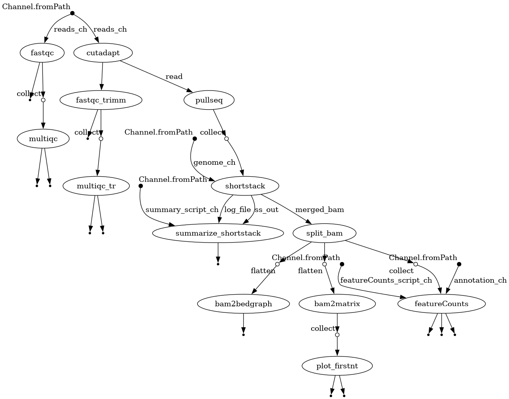

# Alignment of sRNAs using ShortStack

This document describes my pipeline for small RNA (sRNA) alignment using **ShortStack**.
I have developed a **Nextflow** pipeline that processes raw FASTQ files and produces a table of counts generated with the **featureCounts** function from the **Rsubread** package.

## Installation

To run this pipeline, the following dependencies are required:

1. ShortStack 3.8.5
2. Cutadapt
3. FastQC
4. MultiQC
5. pigz
6. R (with the **pacman** package installed at minimum)
7. Bedtools
8. Nextflow

You can install the dependencies individually or set them up easily using **conda**/**mamba**:
```
mamba create -n ss3_env -c bioconda -c conda-forge \
  shortstack=3.8.5 pullseq cutadapt fastqc multiqc pigz \
  r-base r-pacman r-ggpubr r-biocmanager r-bioconductor-rsubread nextflow
```
## How to run

To run the pipeline you need a configuration file (`params.config`) specifying the following input parameters:

1. Path to input FASTQ files
2. Number of threads for Cutadapt
3. Adapter sequence
4. Minimum read length
5. Maximum read length
6. Full path to the genome file
7. Full path to the annotation file
8. Number of threads for ShortStack
9. Memory for ShortStack

> **Note:**  
> The annotation file must contain **double‑stranded entries** for each genomic feature.  
> A sample *C. elegans* annotation is provided in the `example` directory.  
> If you need help preparing a compatible annotation, feel free to contact: **isaac.martinez@utoronto.ca**

A typical `params.config` file looks like this:
```
params {
  reads       = "/home/isaac/storage/Data/CELE_ANN/nextflow/test/*.fastq.gz"
  threads     = 4
  adapter     = "AGATCGGAAGAG"
  minlen      = 18
  maxlen      = 27
  genome      = "/home/isaac/storage/Data/CELE_ANN/nextflow/genome/caenorhabditis_elegans.PRJNA13758.WBPS19.genomic.fa"
  annotation  = "/home/isaac/storage/Data/CELE_ANN/nextflow/annotation/caenorhabditis_elegans.PRJNA13758.WBP19.overlapping_annotation.gff3"
  thr_ss      = 12
  sm_ss       = "12G"
}
```
Once your parameters file is ready, run the pipeline with:
```
nextflow run main.nf -c params.config
```



## Outputs

After successful execution, the pipeline will generate the following directories:

1. **01.raw_qc** – First-pass FastQC reports
2. **02.cut_adapt** – Trimmed reads from Cutadapt
3. **03.trimmed_qc** – Second-pass FastQC and MultiQC reports
4. **04.pullseq** – Filtered libraries based on the defined read-length range
5. **05.ShortStack** – Raw alignment and analysis results from ShortStack
6. **06.summary** – PDF summary of uniquely and multi-mapping reads
7. **07.bams** – Split BAM files per library
8. **08.bam_fn** – Tables with read length and first nucleotide information
9. **09.featureCounts** – Count tables and detailed featureCounts outputs
10. **10.bedGraphs** – bedGraph file with strand information for igv


## Citation

If you use this pipeline in your work, please cite the following tools:

- **ShortStack**
  Axtell MJ. ShortStack: Comprehensive annotation and quantification of small RNA genes. *RNA*. 2013;19(6):740–751.
  https://doi.org/10.1261/rna.035279.112

- **ShortStack (multi‑mapping improvements)**
  Johnson NR, Yeoh JM, Coruh C, Axtell MJ. Improved Placement of Multi‑mapping Small RNAs. *G3: Genes|Genomes|Genetics*. 2016;6(7):2103–2111.
  [https://doi.org/10.1534/g3.116.030452](https://doi.org/10.1534/g3.116.030452)


- **Rsubread (featureCounts)**
  Liao Y, Smyth GK, Shi W. featureCounts: an efficient general purpose program for assigning sequence reads to genomic features. *Bioinformatics*. 2014;30(7):923–930.
  https://doi.org/10.1093/bioinformatics/btt656

- **Cutadapt**
  Martin M. Cutadapt removes adapter sequences from high-throughput sequencing reads. *EMBnet.journal*. 2011;17(1):10–12.
  https://doi.org/10.14806/ej.17.1.200

- **FastQC**
  Andrews S. FastQC: A Quality Control tool for High Throughput Sequence Data. 2010.
  https://www.bioinformatics.babraham.ac.uk/projects/fastqc/

- **MultiQC**
  Ewels P, Magnusson M, Lundin S, Käller M. MultiQC: summarize analysis results for multiple tools and samples in a single report. *Bioinformatics*. 2016;32(19):3047–3048.  
  https://doi.org/10.1093/bioinformatics/btw354

- **Nextflow**
  Di Tommaso P, et al. Nextflow enables reproducible computational workflows. *Nature Biotechnology*. 2017;35:316–319.
  https://doi.org/10.1038/nbt.3820

- **BEDTools**
  Quinlan AR, Hall IM. BEDTools: a flexible suite of utilities for comparing genomic features. *Bioinformatics*. 2010;26(6):841‑842.
  [https://doi.org/10.1093/bioinformatics/btq033](https://doi.org/10.1093/bioinformatics/btq033)

- **Pullseq**
  Pullseq: A Utility Program for Extracting Sequences from a Fasta/Fastq File.
  Available online: [https://github.com/bcthomas/pullseq](https://github.com/bcthomas/pullseq) (accessed on 1 June 2023).


